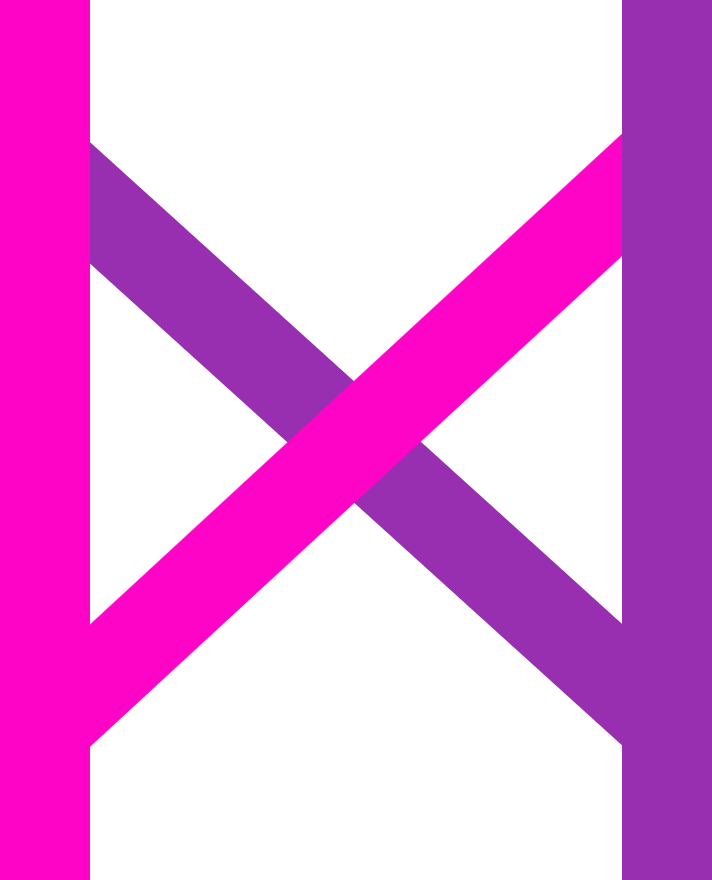

<p align="center">
  <a>
    
  </a>
</p>

# IXC
[](https://www.npmjs.com/package/ixc)
[](https://npmjs.org/package/ixc)

### A UI Toolkit build on Vue.js.

> This branch is for Vue.js 2.x
>
> IXC => I superX Components Meaning

## Features

- Dozens of useful and beautiful components
- Friendly API. It's made for people with any skill level.
- Extensive documentation and demos.
- It is quite beautiful
- supports Vue.js 2

## Install

> Please install Webpack first!

We recommend you create your project throuth [vue-cli](https://github.com/vuejs/vue-cli)

### Install ixc

Using npm:
```
npm install --save ixc
```

## Usage

```vue
<template>
  <XIcon type="log-in" size="30" color="#01adce"></XIcon>
</template>
```

Using css via `import`:

```js
import 'ixc/dist/styles/ixc.css'
```

## Links
- [vue](https://github.com/vuejs/vue)
- [Webpack](https://github.com/webpack/webpack)
- [iView](https://github.com/iview/iview)

## License
[MIT](http://opensource.org/licenses/MIT)

Copyright (c) 2018-present, ixc
